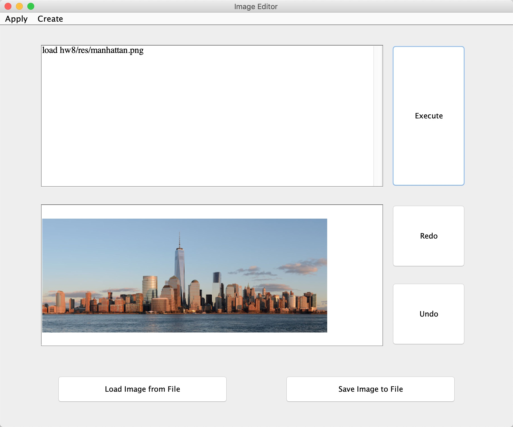
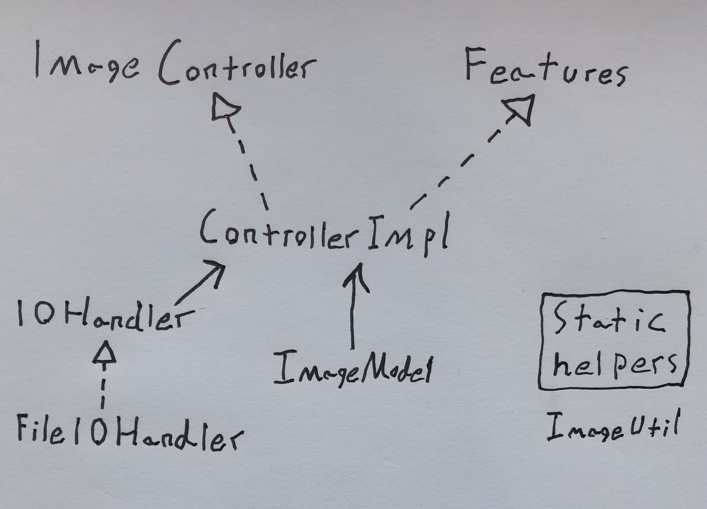
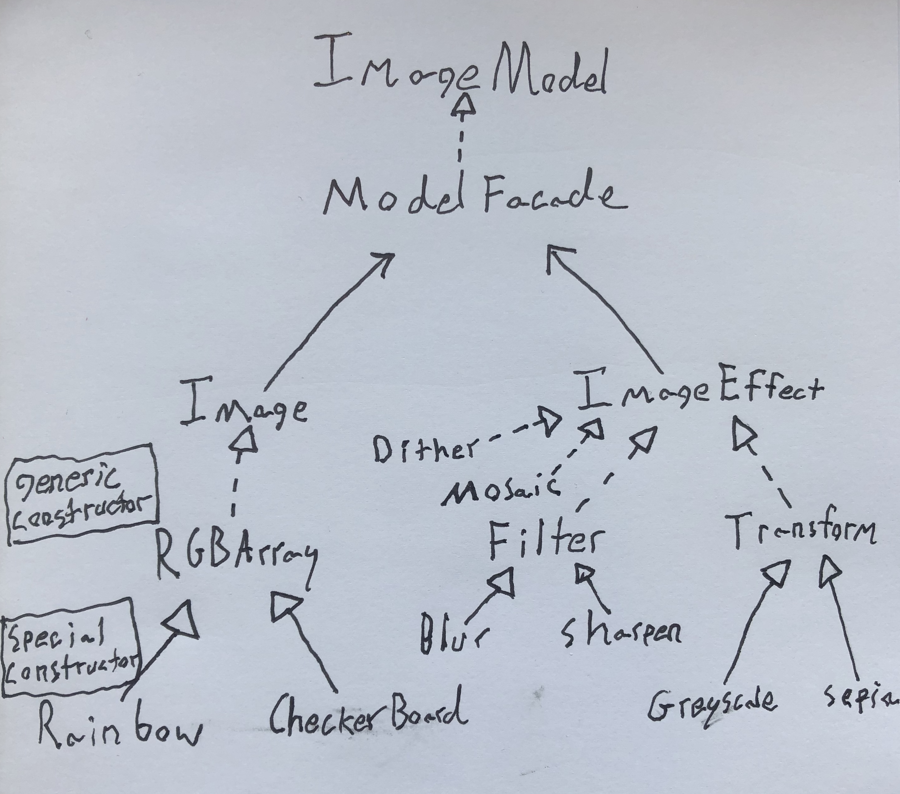

# Image Editor
## By Jiahui Zhang and Ian Magnusson

## What is this
This is a fully operational image editor with a Model View Control (MVC) design pattern. It can load, generate, and save images and apply effects to those images. It can either be controlled through an interactive GUI interface or a noninteractive batch script mode.

We have implemented all the required specifications of the assignment and also implemented the undo/redo extra credit.

## How to use this
Run our .jar file with this commands
```
# to access interactive GUI
java -jar ImageEditor.jar -interactive

# to run on a specified batch script file in Noninteractive Mode
java -jar ImageEditor.jar -script path-of-script-file
```
### Interactive Mode
Before running any other command you must *load* or *create* and image to work on. This can be done in a few ways.
1. Click "Load Image from File" and select an image file to load (supported formats are JPG and PNG)
2. Click the "Create" menu at the top and select one of our image generators to create an image from scratch
3. Use the Script Input Box to execute a Load command (for details on batch script format see Noninteractive Mode section)

Now that you've loaded an image you can apply effects to it.
1. Click the "Apply" menu for a list of effects
2. If a window pops up with options to customize the effect, fill those out and hit apply
3. Alternatively run effects using commands in the Script Input Box (details in Noninteractive Mode section)
3. Layer effects on your image to create your masterpiece!

You can undo and redo your changes. (Note this won't change any save commands you make)
1. Click undo to revert to the next to last image
2. If you have already undone something hit redo to restore the last undone change

Finally, once you are happy with your image you can save it to a file (supported formats are JPG and PNG).
1. Click "Save Image to File"
2. Choose where to save you file
3. Give your file a name ending with .JPG or .PNG

### Noninteractive Mode
Using the -script flag when running ImageEditor.jar will allow you to run batch commands written in a file. These batch commands can also be used in the Script Input Box in the Interactive Mode. The batch commands follow these simple format rules:
- empty lines will be ignored
- comment style lines (beginning with //) will be ignored as well
- command lines must have no leading whitespace
- all other lines will be processed for whitespace separated tokens akin to a shell script
- filepaths used in the Noninteractive Mode start within the res directory in the same directory as the .jar file
- filepaths used in the Interactive Mode Script Input Box start within the same directory as the .jar file

VALID INSTRUCTIONS
- load fileName --> an image must be loaded before any other commands can be processed. All commands will be executed upon last loaded image until a new image is loaded.

- load rainbow width height isHorizontal --> generates a rainbow with the given dimensions and stripe orientation the first two arguments are integers and the last is a boolean.

- load checkerboard size --> generates a checkerboard with tiles of the given dimensions. The arg must be an integer.

- save fileName --> an image needs to be saved in order to be viewed. *.png image type is recommended.

- ImageEffect Parameters--> an ImageEffect can be "blur", "sharpen", "greyscale", "sepia", "dither", and "mosaic". The mosaic effect requires a second parameter numOfSeeds (an integer between 1 ~ 15000) separated by a single space.

### Examples
```
load manhattan.png
dither
save manhattan-dither.png
load manhattan.png
blur
save manhattan-blur.png
sepia
save manhattan-blur-sepia.png
load manhattan.png
sharpen
save manhattan-sharpen.png
sharpen
save manhattan-sharpen-sharpen.png
load manhattan.png
greyscale
save manhattan-greyscale.png
load manhattan.png
sepia
save manhattan-sepia.png
load manhattan.png
mosaic 1000
save manhattan-mosaic-1000.png
load manhattan.png
mosaic 4000
save manhattan-mosaic-4000.png
load manhattan.png
mosaic 8000
save manhattan-mosaic-8000.png
load manhattan.png
mosaic 15000
save manhattan-mosaic-15000.png
```

## Design notes
### View design

                                                                
The view is achieved by a single concrete class ImageView. This class extends JFrame. Its constructor takes a Features object through which it accesses the features of the ControllerImpl and emplaces them in actionListeners. When clicks are registered in the GUI these actionListeners set the controller in motion to orchestrate the appropriate response. The code that sets up the GUI and its listeners in the constructor is broken up into helper methods that group together code for related GUI elements (such as file IO, etc). 

### Controller design

The controller is accessed through two interfaces: ImageController and Features. ImageController provides a method to parse batch script text. Features provides methods with generalized tasks for loading, saving, creating, and effecting images. These feature methods are utilized both in the batch script parser and in the ImageView's actionListeners. The ControllerImpl concrete class implements both of these interfaces. It has a Readable (the source for batch script text), an IOHandler, and a ImageModel which are all set by its constructor. This allows mocking and redirection of all its inputs and outputs. IOHandler is an interface implemented by FileIOHandler that sets a base directory for image file lookup. Finally static helper methods for image format parsing are located in ImageUtil (code provided by instructors).

### Model Design

The ImageModel provides a top level interface that unifies all other parts of the model. The ModelFacade implements this interface by composing an Image object and an ImageEffect object. One Image and one ImageEffect at a time can be loaded into the model. The model can then apply the effect, which updates its stored Image with the output of the running the ImageEffect on its stored Image. The model also keeps two stacks of past and subsequent images (stored as int arrays) to allow perform and undo and redo feature. (This was implemented in the model so that future versions could implement a more performant undo and redo that takes advantage of the specifics of the effect algorithms to avoid saving recreatable data). The Image and ImageEffect interfaces are implemented by a number of concrete class following a command design pattern to facilitate extensibility.


**Images and ImageEffects both follow a similar pattern: 
The interfaces provide a common way to access objects**

- Image {stores image data of various formats}
- ImageEffect {generates a new image based on some input image}

**These are implemented by generalized, concrete classes that are constructed with raw data. These encapsulate shared code and provide an easy way to define custom kernels, color transformation matrices, and pixel values. Once constructed their data is
immutable and data is extensively validated on construction.**

(Implementing Image)
- RGBArray {an image constructed with a multi dimensional int array

(Implementing ImageEffect)
- Filter {a kernel convolver that takes any kernel}
- Transform {a color transformer that takes any matrix}
- Dither {presently hardcodes a dither matrix, but future versions could allow input of any desired Dither}
- Mosaic {a color clusterer that takes a number of seeds}

**Finally, a set of convenience classes extend the generalized classes and provide helpful constructors. These are similar to wrapper methods on a higher order function that package a commonly used lambda to give it a user-friendly name.**

(extending RGBArray)
- Rainbow {generates a vertical or horizontal rainbow of a specified size}
- CheckerBoard {generates an 8x8 CheckerBoard with tiles of a given size}

(extending Filter)
- Blur {a filter with a predefined blur kernel}
- Sharpen {a filter with a predefined sharpen kernel}

(extending Transform)
- Grayscale {a transform with a predefined grayscale matrix}
- Sepia {a transform with a predefined sepia matrix}

## Changes to previous design
In assignment 10 we made a few improvements to previous code. First, as discussed elsewhere we added a undo/redo feature to the model, because this enables future versions to implement a more performant approach that takes advantage of the specifics of effect algorithms to avoid saving reconstructable image data. Second, we modified the controller to implement the Features interface and then used those features in both our new GUI view and in our batch script parser. We decided to modify our existing controller rather than making two controllers because the GUI fully integrates the batch script interface. The previous design also made it easy to plug in batch script text from a non-file source, because the controller gets its batch script data from a readable.

## Photo credits:

fluffy.jpg is an original photo by Jiahui Zhang, authorized for use in this project

jackPic.jpg is an original photo by Ian Magnusson, authorized for use in this project
